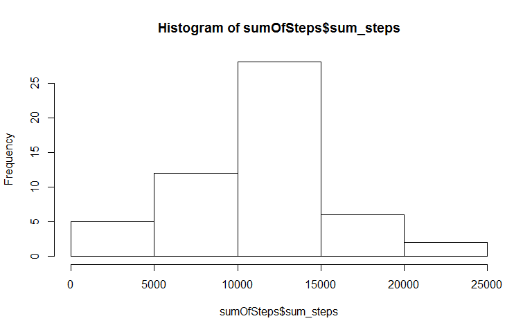
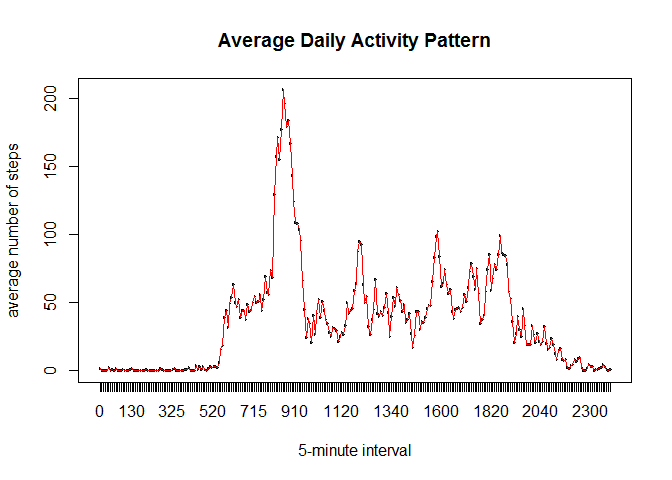
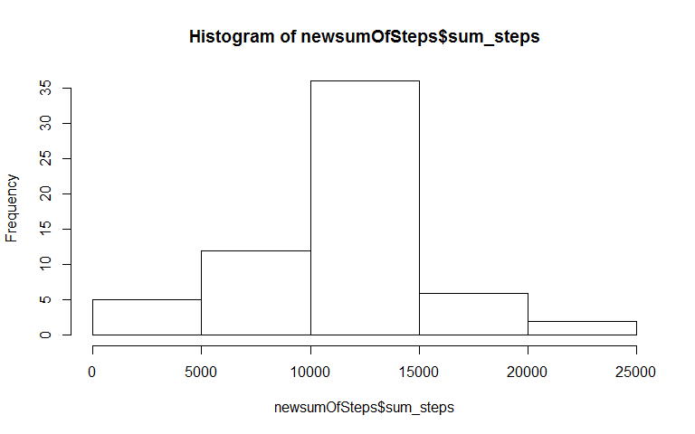
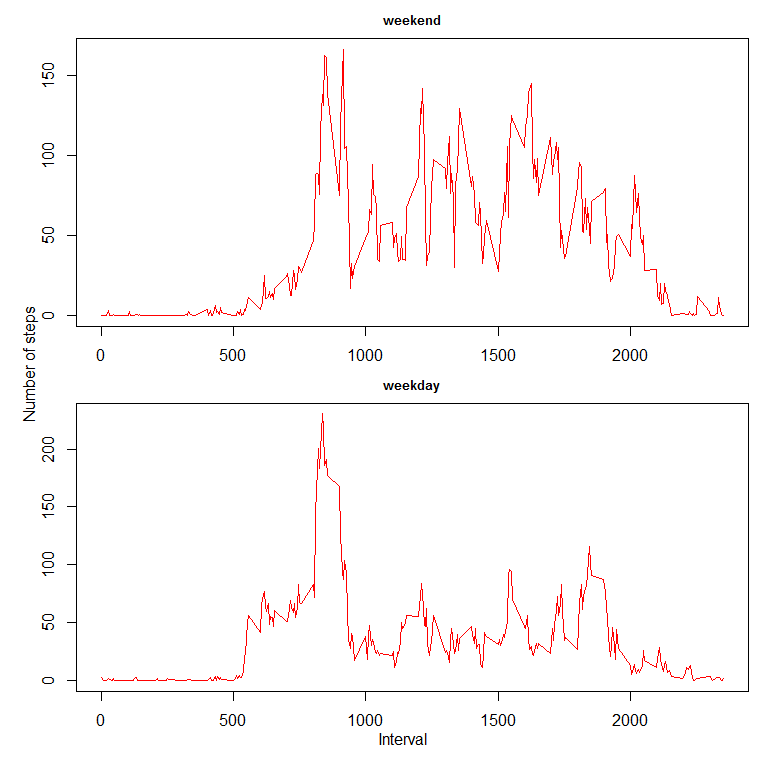

# Reproducible Research: Peer Assessment 1
 This is the assignment #1 for course "Reproducible Research". The assignment will generate a report to perform some analysis to the dataset [Activity monitoring data](https://d396qusza40orc.cloudfront.net/repdata%2Fdata%2Factivity.zip). The data was generated from a personal activity monitoring device every 5-minute for about 2 months in year 2012. The variables included in the dataset are:
 
 - **steps**: Number of steps takeing in a 5-minute interval.
 - **date**: The date on which the measurement was taken in YYY-MM-DD format.
 - **interval**: Identifier for the 5-minute interval in which measurement was taken.

## Loading and pre-processing the data

- Load the data using read.csv(). Assume the data file activity.csv is in the same directory of the Rmd file.


```r
# Read the data from csv file
activityCSV <- read.csv("./activity.csv")
# Take a look at the raw data
head(activityCSV)
```

```
##   steps       date interval
## 1    NA 2012-10-01        0
## 2    NA 2012-10-01        5
## 3    NA 2012-10-01       10
## 4    NA 2012-10-01       15
## 5    NA 2012-10-01       20
## 6    NA 2012-10-01       25
```

- Remove the NAs from the data set

```r
# Remove the rows that has NA in steps column
activityDS <- activityCSV[!is.na(activityCSV$steps),]
# Take a look at the data after removing the NAs, comparing with the raw data
head(activityDS)
```

```
##     steps       date interval
## 289     0 2012-10-02        0
## 290     0 2012-10-02        5
## 291     0 2012-10-02       10
## 292     0 2012-10-02       15
## 293     0 2012-10-02       20
## 294     0 2012-10-02       25
```

## What is mean total number of steps taken per day?

- Calculate the sum of steps for each day 


```r
# Get the sum of steps for each date in the dataset
sumOfSteps <- aggregate(steps ~ date, data=activityDS, sum)
names(sumOfSteps) <- c("Date", "sum_steps")
```

- Make a histogram of the total number of steps taken each day


```r
# Generate histogram for the calculated data - sum of steps
hist(sumOfSteps$sum_steps)
```

 

- Calculate and report the mean and median of the total number of steps taken per day


```r
# Get the mean of steps for each date in the dataset
meanOfSteps <- aggregate(steps ~ date, data=activityDS, mean)
names(meanOfSteps) <- c("Date", "mean_steps")

# Get the median value of steps for each date in the dataset
medianOfSteps <- aggregate(steps ~ date, data=activityDS, median)
names(medianOfSteps) <- c("Date", "median_steps")

# Merge the two data sets and report the result
mergedSteps <- merge(medianOfSteps, meanOfSteps, by="Date")
names(mergedSteps) <- c("Date", "median_steps", "mean_steps")

# Take a look at the merged data set
head(mergedSteps)
```

```
##         Date median_steps mean_steps
## 1 2012-10-02            0    0.43750
## 2 2012-10-03            0   39.41667
## 3 2012-10-04            0   42.06944
## 4 2012-10-05            0   46.15972
## 5 2012-10-06            0   53.54167
## 6 2012-10-07            0   38.24653
```

## What is the average daily activity pattern?

- Make a time series plot (i.e. type = "l") of the 5-minute interval (x-axis) and the average number of steps taken, averaged across all days (y-axis)


```r
# Convert the interval to factor
activityDS$interval <- factor(activityDS$interval)

# Calculate the average number of steps taken per interval across all days
meanOfStepsPerInterval <- aggregate(steps ~ interval, data = activityDS, mean)
names(meanOfStepsPerInterval) <- c("Interval", "mean_steps_per_interval")

# Create time seriesdiagram
plot(meanOfStepsPerInterval$Interval, meanOfStepsPerInterval$mean_steps_per_interval,
           xlab="5-minute interval", ylab="average number of steps", 
           main="Average Daily Activity Pattern")
lines(meanOfStepsPerInterval$Interval, meanOfStepsPerInterval$mean_steps_per_interval, type="l", col="red")
```

 

- Which 5-minute interval, on average across all the days in the dataset, contains the maximum number of steps?

```r
# Get the max number from the mean of the steps for each 5-minute interval
maxStepInterval <- meanOfStepsPerInterval[meanOfStepsPerInterval$mean_steps_per_interval==max(meanOfStepsPerInterval$mean_steps_per_interval), ]
names(maxStepInterval) <- c("Interval", "max-number-of-steps")

# Output result
maxStepInterval
```

```
##     Interval max-number-of-steps
## 104      835            206.1698
```

As we can see, at interval #835, this person has the maximum of steps: in an average of ~206 steps.

## Imputing missing values
Note that there are a number of days/intervals where there are missing values (coded as NA). The presence of missing days may introduce bias into some calculations or summaries of the data.

- Calculate and report the total number of missing values in the dataset (i.e. the total number of rows with NAs)


```r
# Get all the rows with steps=NA
activityNA <- activityCSV[is.na(activityCSV$steps), ]
# Output # of rows
nrow(activityNA)
```

```
## [1] 2304
```

There are 2304 rows in the data set that has NA in steps column.

- Devise a strategy for filling in all of the missing values in the dataset. The strategy does not need to be sophisticated. For example, you could use the mean/median for that day, or the mean for that 5-minute interval, etc. Let's use mean of the 5-minute interval to fill in the NA's in an interval.


```r
# Every day, we have 2355 5-minute intervals
interval <- 0
while (interval <= 2355)
{
        # Only take the mean's for the 5-minute interval and save them in tmp
        tmp <- meanOfStepsPerInterval[meanOfStepsPerInterval$Interval==interval, ][2]
        
        # Repalce the NA using the above number by specifying "interval" in data frame "activityNA"
        activityNA[activityNA$interval==interval, ]$steps <- rep(tmp, nrow(activityNA[activityNA$interval==interval, ]))
        
        # Increase steps by 5 minutes
        interval <- interval + 5
}
```


- Create a new dataset that is equal to the original dataset but with the missing data filled in.


```r
# Merge the non-NA dataset with dataset that replaced NA with mean of 5-minute intervals
newactivityDS <- rbind(activityNA, activityDS)
# Format the new data set to ensure steps are numeric and interval is factored
newactivityDS$steps <- as.numeric(newactivityDS$steps)
newactivityDS$interval <- factor(newactivityDS$interval)
```


- Make a histogram of the total number of steps taken each day and Calculate and report the mean and median total number of steps taken per day. Do these values differ from the estimates from the first part of the assignment? What is the impact of imputing missing data on the estimates of the total daily number of steps?


```r
# Get the sum of steps for each date in the dataset
newsumOfSteps <- aggregate(steps ~ date, data=newactivityDS, sum)
names(newsumOfSteps) <- c("Date", "sum_steps")

# Generate histogram of new data set
hist(newsumOfSteps$sum_steps)
```

 

```r
# Generate histogram of old data set
hist(sumOfSteps$sum_steps)
```

 

From the two histograms, we can see that by adding the dataset that had NA in it before but replacing with average 5-minute intervals, the number of days in new data set that total steps is between 10,000 to 15,000 (35 days) is about 10 more than the number of days in old data set (25 days). Other than this, the pattern is the same between old data set and new data set.

## Are there differences in activity patterns between weekdays and weekends?

We will use the dataset with the filled-in missing values for the anaylsis.

- Create a new factor variable in the dataset with two levels - "weekday" and "weekend" indicating whether a given date is a weekday or weekend day.


```r
# Convert the date into "weekday"
newactivityDS$WeekDayName <- weekdays(as.Date(levels(newactivityDS$date)[newactivityDS$date]))

# Replace "Sat" & "Sun" with "weekend"
tmp_weekend <- newactivityDS[newactivityDS$WeekDayName=="Sunday" | newactivityDS$WeekDayName=="Saturday", ]
tmp_weekend$WeekDayName <- rep("weekend", nrow(tmp_weekend))

# Replace ""Mon" - "Fri" with "weekday""
tmp_weekday <- newactivityDS[newactivityDS$WeekDayNam !="Sunday" & newactivityDS$WeekDayNam !="Saturday", ]
tmp_weekday$WeekDayName <- rep("weekday", nrow(tmp_weekday))

## Merge "tmp_weekend" and "tmp_weekday" together
dsWithWeekdayName <- rbind(tmp_weekend, tmp_weekday)
dsWithWeekdayName$steps <- as.numeric(dsWithWeekdayName$steps)
dsWithWeekdayName$WeekDayName <- factor(dsWithWeekdayName$WeekDayName)
```

- Make a panel plot containing a time series plot (i.e. type = "l") of the 5-minute interval (x-axis) and the average number of steps taken, averaged across all weekday days or weekend days (y-axis). See the README file in the GitHub repository to see an example of what this plot should look like using simulated data.


```r
mean_steps_weekday <- aggregate(steps ~ interval, data=tmp_weekday, mean)
mean_steps_weekend <- aggregate(steps ~ interval, data=tmp_weekend, mean)

# Sort by interval
mean_steps_weekday$interval <- as.numeric(levels(mean_steps_weekday$interval))[mean_steps_weekday$interval]
mean_steps_weekday <- mean_steps_weekday[order(mean_steps_weekday$interval), ]

mean_steps_weekend$interval <- as.numeric(levels(mean_steps_weekend$interval))[mean_steps_weekend$interval]
mean_steps_weekend <- mean_steps_weekend[order(mean_steps_weekend$interval), ]

## Generate diagram 
par(mfrow=c(2,1), mar=c(2,2,2,1), oma=c(2,2,0,0))
plot(mean_steps_weekend$interval, mean_steps_weekend$steps, type="l", col="red", xlab="", ylab="", main="weekend", cex.main=0.8)
plot(mean_steps_weekday$interval, mean_steps_weekday$steps, type="l", col="red", xlab="", ylab="", main="weekday", cex.main=0.8)
mtext("Number of steps", side=2, outer=TRUE)
mtext("Interval", side=1, outer=TRUE)
```

 

From the diagram, we can see this person had more activities in weekend than in weekdays. 
